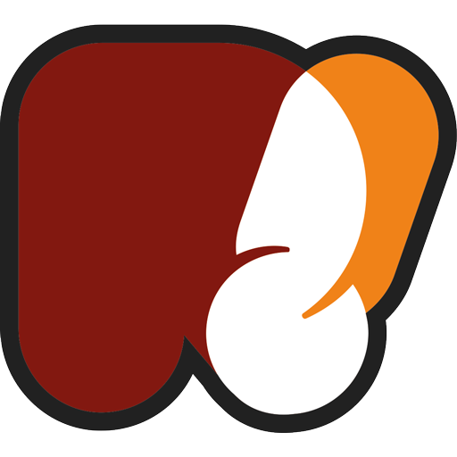
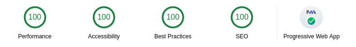

<div align="center"  style="margin-bottom:30px">
    
</div>


<div align="center">
    
    <a href="https://codeclimate.com/github/rawsta/rawblog/maintainability">
      
    </a>
    <a href='https://codeclimate.com/github/rawsta/rawblog'>
      
    </a>
    <a href='https://www.codacy.com/app/rawsta/rawblog?utm_source=github.com&utm_medium=referral&utm_content=rawsta/rawblog&utm_campaign=Badge_Grade'>
      
    </a>
    <a href='https://github.com/prettier/prettier'>
      
    </a>
    
</div>

# rawBlog | rawsta's playground

Der Plan ist eine neue Webseite mit React/Gatsby aufzubauen und dabei endlich auch mehr JavaScript und React zu lernen.
Um den Start etwas zu vereinfachen habe ich mit dem [`Gatsby Advanced Starter` von `Vagr9K`](https://github.com/Vagr9K/gatsby-advanced-starter/) angefangen.

Aktueller Status: [](https://app.netlify.com/sites/rawblog/deploys)

...und hier die [Demo website.](https://rawblog.netlify.app)

## Lighthouse Audit Score

<div align="center">
    <a href="https://developers.google.com/web/tools/lighthouse/">
      
    </a>
</div>

Der Score bevor ich mich dran gesetzt habe.

## Why?

Y not?

## Features

- Gatsby v2 support
- Blazing fast loading times thanks to pre-rendered HTML and automatic chunk loading of JS files
- Posts in Markdown
  - Code syntax highlighting *(via vs-code)*
  - Embed YouTube videos
  - Embed Tweets
- Pagination
  - Configurable via `SiteConfig.js`
- Tags
  - Separate page for snippets under each tag
- Categories
  - Separate page for posts under each category
- `/static/` and content folders are available to use with [gatsby-image](https://www.gatsbyjs.org/docs/gatsby-image/) out of the box for optimized image generation
- High configurability
- Separate components for everything:
  - User social profiles
  - Copyright information
  - Maybe Unicorns
  - Probably more!
- [NetlifyCMS](https://www.netlifycms.org) support out of the box
- PWA features
  - Offline support *hopefully*
  - Web App Manifest support
  - Loading progress for slow networks
- SEO
  - Sitemap generation
  - robots.txt
  - General description tags
  - [Schema.org JSONLD (Google Rich Snippets)](https://schema.org/)
  - [OpenGraph Tags (Facebook/Google+/Pinterest)](https://ogp.me/)
  - [Twitter Tags (Twitter Cards)](https://developer.twitter.com/en/docs/tweets/optimize-with-cards/overview/markup)
- RSS feeds
- Social features removed! _mostly_
- Development tools
  - [ESLint](https://eslint.org/) for linting
  - [Prettier](https://prettier.io/) for code formatting
  - Remark-Lint for linting Markdown
  - write-good for linting English prose
  - gh-pages for deploying to GitHub pages
  - [Netlify](https://www.netlify.com/) deploy configuration
  - [CodeClimate](https://codeclimate.com/) configuration file and badge
- and much more

## Getting Started

Install my website (assuming [Gatsby](https://github.com/gatsbyjs/gatsby/) is installed and updated) by running from your CLI:

```sh
gatsby new YourAwesomeProject https://github.com/rawsta/rawblog
npm run develop # or gatsby develop
```

Or you can fork the project, make your changes there and merge new features when needed.

Alternatively:

```sh
git clone https://github.com/rawsta/rawblog YourAwesomeProject # Clone the project
cd YourAwesomeProject
rm -rf .git # So you can have your own changes stored in VCS.
npm install # or yarn install or npx install or voodoo
npm run develop # or gatsby develop or yarn run develop or ...you get it.
```

Please don't forget to remove my content if just clone everything.

## Configuration

Edit the export object in `data/SiteConfig`:

```js
module.exports = {
  siteTitle: "Gatsby Advanced Starter", // Site title.
  siteTitleShort: "GA Starter", // Short site title for homescreen (PWA). Preferably should be under 12 characters to prevent truncation.
  siteTitleAlt: "GatsbyJS Advanced Starter", // Alternative site title for SEO.
  siteLogo: "/logos/logo-1024.png", // Logo used for SEO and manifest.
  siteUrl: "https://gatsby-advanced-starter-demo.netlify.com", // Domain of your website without pathPrefix.
  pathPrefix: "/", // Prefixes all links. For cases when deployed to example.github.io/gatsby-advanced-starter/.
  siteDescription: "A GatsbyJS stater with Advanced design in mind.", // Website description used for RSS feeds/meta description tag.
  siteRss: "/rss.xml", // Path to the RSS file.
  postDefaultCategoryID: "Tech", // Default category for posts.
  dateFromFormat: "YYYY-MM-DD", // Date format used in the frontmatter.
  dateFormat: "DD/MM/YYYY", // Date format for display.
  postsPerPage: 4, // Amount of posts displayed per listing page.
  userName: "Advanced User", // Username to display in the author segment.
  userEmail: "AdvancedUser@example.com", // Email used for RSS feed's author segment
  userTwitter: "", // Optionally renders "Follow Me" in the UserInfo segment.
  userLocation: "North Pole, Earth", // User location to display in the author segment.
  userAvatar: "https://api.adorable.io/avatars/150/test.png", // User avatar to display in the author segment.
  userDescription:
    "Yeah, I like animals better than people sometimes... Especially dogs. Dogs are the best. Every time you come home, they act like they haven't seen you in a year. And the good thing about dogs... is they got different dogs for different people.", // User description to display in the author segment.
  // Links to social profiles/projects you want to display in the author segment/navigation bar.
  userLinks: [
    {
      label: "GitHub",
      url: "https://github.com/rawsta/rawblog",
      iconClassName: "fa fa-github"
    },
    {
      label: "Twitter",
      url: "https://twitter.com/rawsta",
      iconClassName: "fa fa-twitter"
    },
    {
      label: "Email",
      url: "mailto:rawsta@rawsta.de",
      iconClassName: "fa fa-envelope"
    }
  ],
  copyright: "Copyright © 2020. Advanced User", // Copyright string for the footer of the website and RSS feed.
  themeColor: "#ff8300", // Used for setting manifest and progress theme colors.
  backgroundColor: "#e0e0e0" // Used for setting manifest background color.
};
```

If want to customize Netlify CMS, e.g. registering custom widgets or styling the preview pane, you can do so by editing `src/netlifycms/index.js`:

```js
import CMS from "netlify-cms-app";

CMS.init({
  config: {
    backend: {
      name: "git-gateway"
    }
  }
});
```

You can also optionally set `pathPrefix`:

```js
module.exports = {
  // Note: it must *not* have a trailing slash.
  pathPrefix: "/your-awesome-creation" // Prefixes all links. For cases when deployed to example.github.io/your-awesome-creation/.
};
```

WARNING: Make sure to edit `static/robots.txt` to include your domain for the sitemap!

# More Badges!


]

# Authors

Ruben Harutyunyan ([@Vagr9K](https://twitter.com/Vagr9K))

Sebastian Fiele ([@rawsta](https://twitter.com/rawsta))
